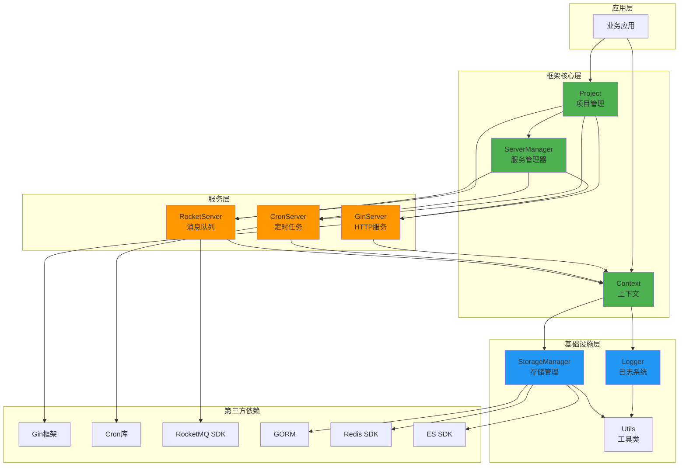
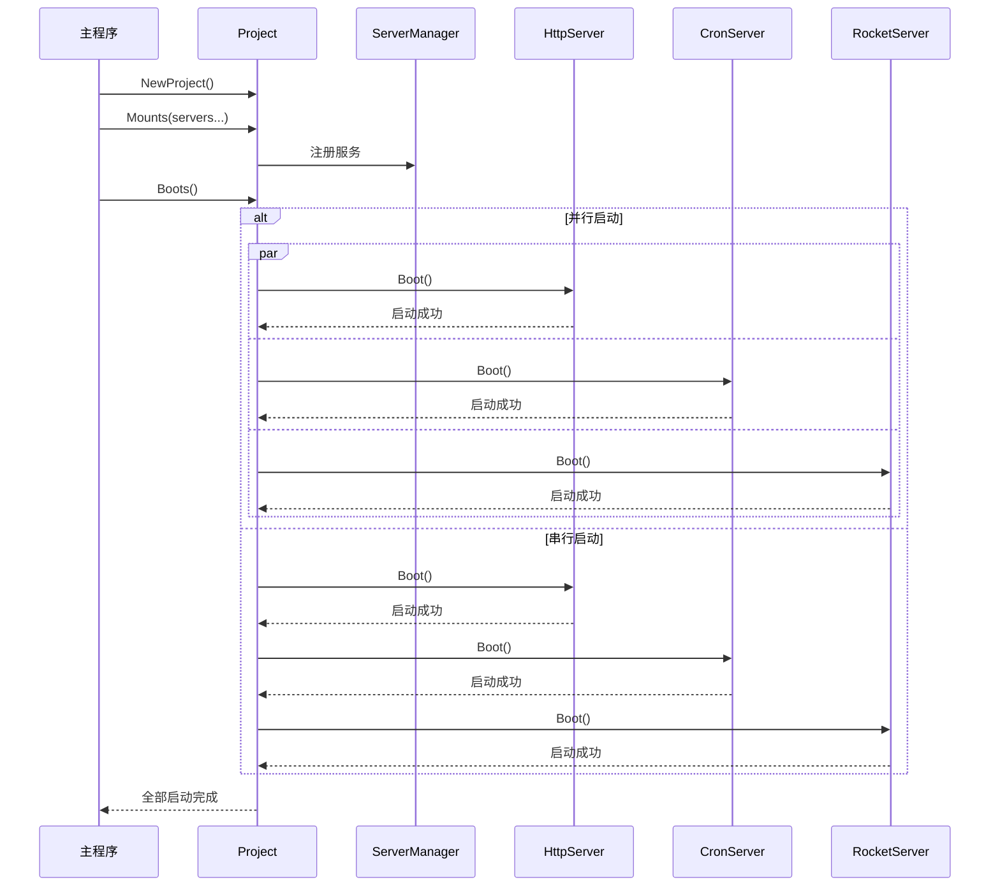
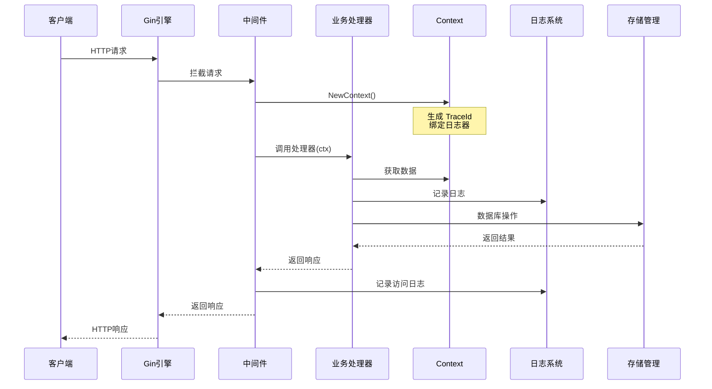
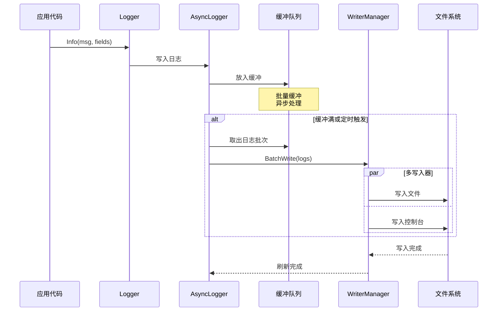
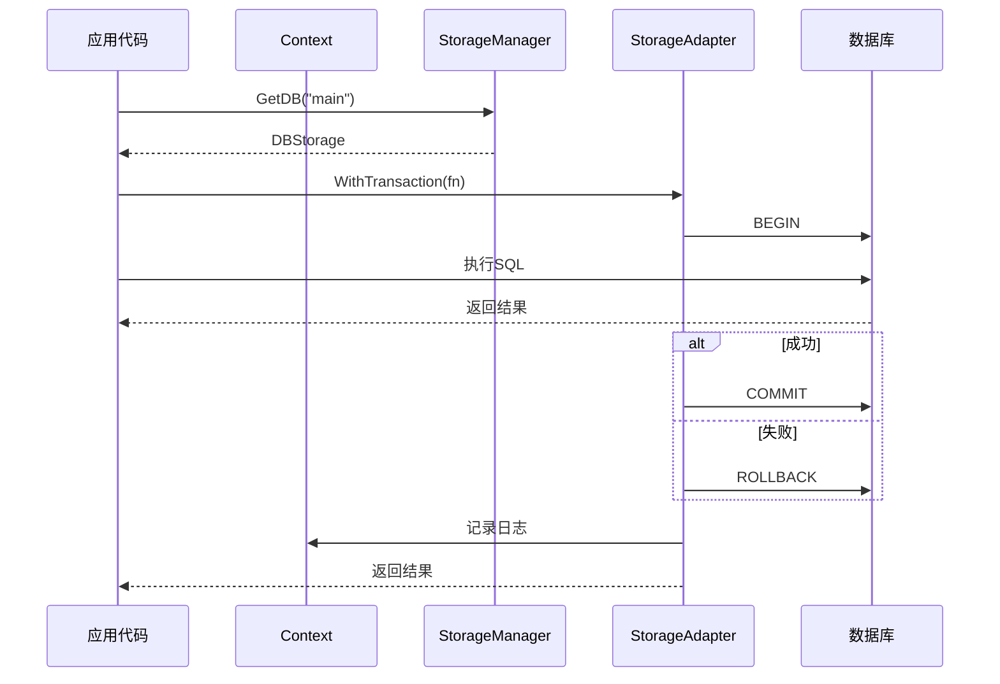

# Sylph 框架架构文档

## 📐 模块依赖关系图



## 🔄 核心流程图

### 1. 服务启动流程



### 2. HTTP 请求处理流程



### 3. 日志处理流程



### 4. 存储访问流程



## 🎨 模块详细设计

### 1. Project 模块

```go
// 项目管理核心
type Project struct {
    servers          []IServer       // 服务列表
    shutdownTimeout  time.Duration   // 关闭超时
    bootTimeout      time.Duration   // 启动超时
    orderedExecution bool            // 串行/并行
    state            atomic.Int32    // 原子状态
    mu               sync.RWMutex    // 读写锁
}

// 状态机
StateStopped -> StateStarting -> StateRunning -> StateStopping -> StateStopped
```

**设计亮点:**
- ✅ 原子操作保证状态安全
- ✅ 优雅关闭机制
- ✅ 灵活的启动策略
- ✅ 完善的错误处理

### 2. Context 模块

```go
// 请求上下文
type DefaultContext struct {
    ctxInternal context.Context    // 标准上下文
    dataCache   map[string]any     // 数据缓存
    rwMutex     sync.RWMutex       // 读写锁
    Header      *Header            // 请求头
    logger      *Logger            // 日志器
}
```

**设计亮点:**
- ✅ 线程安全的数据存储
- ✅ 支持标准 context.Context
- ✅ 内置日志绑定
- ✅ Clone 支持

### 3. Logger 模块

```go
// 异步日志核心
type AsyncLogger struct {
    buffer       chan *LoggerMessage  // 异步缓冲
    flushTicker  *time.Ticker        // 定时刷新
    batchSize    int                 // 批量大小
    writers      []io.Writer         // 多写入器
}

// 日志管理器
type LoggerManager struct {
    loggers map[Endpoint]*Logger    // 端点隔离
    builder *LoggerBuilder          // 构建器
}
```

**设计亮点:**
- ✅ 异步批量写入
- ✅ 多端点隔离
- ✅ 灵活的格式化
- ✅ 可扩展的钩子

### 4. Storage 模块

```go
// 存储管理器
type StorageManagerImpl struct {
    dbMap    map[string]DBStorage    // MySQL实例
    redisMap map[string]RedisStorage // Redis实例
    esMap    map[string]ESStorage    // ES实例
    mu       sync.RWMutex            // 读写锁
}

// 统一的存储接口
type Storage interface {
    GetType() StorageType
    GetName() string
    IsConnected() bool
    Connect(ctx Context) error
    Disconnect(ctx Context) error
    Ping(ctx Context) error
    GetHealthStatus() *HealthStatus
}
```

**设计亮点:**
- ✅ 统一的抽象接口
- ✅ 多实例管理
- ✅ 健康检查机制
- ✅ 连接池管理

## 🔐 设计模式应用

### 1. **接口驱动设计**
```go
// 统一的服务接口
type IServer interface {
    Name() string
    Boot() error
    Shutdown() error
}
```

### 2. **函数式选项模式**
```go
// 灵活的配置
project := NewProject(
    WithShutdownTimeout(10*time.Second),
    WithBootTimeout(30*time.Second),
    WithOrderedExecution(true),
)
```

### 3. **适配器模式**
```go
// 存储适配器
type MysqlStorageAdapter struct {
    name string
    db   *gorm.DB
}

func (a *MysqlStorageAdapter) GetDB() *gorm.DB {
    return a.db
}
```

### 4. **构建器模式**
```go
// 日志构建器
logger := NewLoggerBuilder().
    WithEndpoint("api").
    WithLevel(logrus.InfoLevel).
    WithOutput(os.Stdout).
    Build()
```

### 5. **管理器模式**
```go
// 统一管理
type StorageManager interface {
    GetDB(name ...string) (DBStorage, error)
    GetRedis(name ...string) (RedisStorage, error)
    GetES(name ...string) (ESStorage, error)
}
```

## 📊 性能优化策略

### 1. **异步处理**
- 日志异步批量写入
- 消息异步处理
- 事件异步分发

### 2. **连接池管理**
- MySQL 连接池
- Redis 连接池
- HTTP 连接复用

### 3. **内存优化**
- ✅ 已移除 sync.Pool（不必要的优化）
- 使用 sync.RWMutex 减少锁竞争
- 批量操作减少内存分配

### 4. **并发控制**
- goroutine 池管理
- 信号量控制
- Context 超时控制

## 🔒 线程安全保证

### 1. **Context 数据访问**
```go
// 使用 RWMutex 保护
type DefaultContext struct {
    dataCache map[string]any
    rwMutex   sync.RWMutex
}

func (d *DefaultContext) Set(key string, value any) {
    d.rwMutex.Lock()
    defer d.rwMutex.Unlock()
    d.dataCache[key] = value
}
```

### 2. **服务状态管理**
```go
// 使用 atomic 原子操作
type Project struct {
    state atomic.Int32
}

func (p *Project) setState(state State) {
    atomic.StoreInt32(&p.state, int32(state))
}
```

### 3. **存储管理器**
```go
// 使用 RWMutex 保护映射
type StorageManagerImpl struct {
    dbMap map[string]DBStorage
    mu    sync.RWMutex
}
```

## 🚀 扩展指南

### 1. **添加新的服务类型**

```go
// 1. 实现 IServer 接口
type MyServer struct {
    // 你的字段
}

func (s *MyServer) Name() string {
    return "my-server"
}

func (s *MyServer) Boot() error {
    // 启动逻辑
    return nil
}

func (s *MyServer) Shutdown() error {
    // 关闭逻辑
    return nil
}

// 2. 注册到 Project
project.Mounts(myServer)
```

### 2. **添加新的存储类型**

```go
// 1. 实现 Storage 接口
type MongoStorage struct {
    // MongoDB 相关
}

// 2. 实现接口方法
func (m *MongoStorage) GetType() StorageType {
    return "mongodb"
}

// 3. 注册到 StorageManager
storageManager.Register("main", mongoStorage)
```

### 3. **自定义日志格式化**

```go
// 实现 Formatter 接口
type MyFormatter struct {}

func (f *MyFormatter) Format(entry *logrus.Entry) ([]byte, error) {
    // 自定义格式化
    return []byte(entry.Message), nil
}

// 使用自定义格式化
logger.SetFormatter(&MyFormatter{})
```

## 📝 使用示例

### 完整应用示例

```go
package main

import (
    "github.com/sylphbyte/sylph"
    "log"
)

func main() {
    // 1. 初始化存储
    storage, err := sylph.InitializeStorage(
        "./config/storage.yaml",
        map[string]bool{"main": true},
        map[string]bool{"main": true},
        map[string]bool{"main": true},
    )
    if err != nil {
        log.Fatal(err)
    }
    
    // 2. 创建 HTTP 服务
    httpServer := sylph.NewGinServer(
        sylph.WithPort(8080),
        sylph.WithRoutes(routes...),
    )
    
    // 3. 创建 Cron 服务
    cronServer := sylph.NewCronServer(
        sylph.WithLocation("Asia/Shanghai"),
        sylph.WithJobs(jobs...),
    )
    
    // 4. 创建项目
    project := sylph.NewProject(
        sylph.WithShutdownTimeout(10 * time.Second),
    )
    
    // 5. 装载服务
    project.Mounts(httpServer, cronServer)
    
    // 6. 启动服务
    if err := project.Boots(); err != nil {
        log.Fatal(err)
    }
    
    // 7. 等待退出信号
    project.WaitForShutdown()
    
    // 8. 优雅关闭
    if err := project.Shutdowns(); err != nil {
        log.Error(err)
    }
}
```

---

**Sylph 框架提供了清晰的架构和灵活的扩展能力，是构建微服务应用的理想选择！** 🎉

